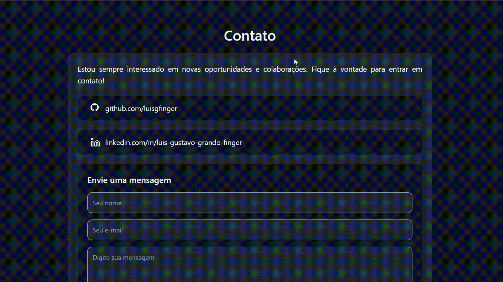

# Portfólio Pessoal | Luis Gustavo Grando Finger

Aplicação web desenvolvida para apresentar minha trajetória como Engenheiro de Software, destacar projetos relevantes e facilitar o contato profissional em uma experiência moderna, responsiva e objetiva.

Este projeto resume bem minha forma de estruturar interfaces, organizar componentes reutilizáveis, integrar serviços externos e transformar apresentação profissional em produto digital.

Demo online: [luisgrandoportfolio.netlify.app](https://luisgrandoportfolio.netlify.app/)

Versão desktop:


Envio de email via AWS Lambda:


## Índice

- [Visão geral](#visao-geral)
- [O que este projeto demonstra](#o-que-este-projeto-demonstra)
- [Funcionalidades](#funcionalidades)
- [Stack e ferramentas](#stack-e-ferramentas)
- [Fluxo de sandbox com Codex](#fluxo-de-sandbox-com-codex)
- [Arquitetura do front-end](#arquitetura-do-front-end)
- [Como executar localmente](#como-executar-localmente)
- [Variáveis de ambiente](#variaveis-de-ambiente)
- [Scripts disponíveis](#scripts-disponiveis)
- [Estrutura de pastas](#estrutura-de-pastas)
- [Contato](#contato)

<a id="visao-geral"></a>
## Visão geral

Este repositório contém o front-end de uma SPA construída com React, TypeScript e Vite para consolidar minha presença profissional em um único ambiente. A aplicação foi pensada para ser direta na comunicação, agradável na navegação e consistente em diferentes tamanhos de tela.

O formulário de contato consome um endpoint externo configurado por variável de ambiente. A interface e o fluxo do cliente estão neste repositório; a implementação do backend não faz parte deste código.

Hoje, o projeto reúne:

- seção inicial com posicionamento profissional e links externos;
- apresentação resumida da minha atuação como desenvolvedor Full Stack;
- vitrine de projetos com navegação interativa;
- bloco de habilidades técnicas;
- formulário de contato integrado a um endpoint externo;
- suporte a tema claro e escuro com persistência da preferência do usuário;
- animação de fundo com arquivos Lottie, incluindo variações para os temas claro e escuro.

<a id="o-que-este-projeto-demonstra"></a>
## O que este projeto demonstra

- Organização de interface em componentes reutilizáveis e responsabilidades bem separadas.
- Construção de experiência responsiva com atenção à navegação em mobile e desktop.
- Gerenciamento simples e eficiente de estado local para tema, menu e formulário.
- Integração do front-end com endpoint externo para envio de mensagens, com tratamento de timeout e feedback visual.
- Preocupação com experiência de uso, incluindo rolagem suave, notificações e interação por swipe no carrossel de projetos.
- Aplicação de medidas práticas de proteção no fluxo de contato, com campo honeypot contra bots e bloqueio do envio quando a URL da API não está configurada.

<a id="funcionalidades"></a>
## Funcionalidades

- Navegação por âncoras entre as seções `Home`, `Sobre`, `Projetos`, `Habilidades` e `Contato`.
- Barra de navegação fixa com comportamento de ocultação ao rolar a página.
- Menu mobile com alternância por botão hambúrguer.
- Alternância entre tema claro e escuro.
- Persistência do tema com `localStorage` e respeito à preferência inicial do sistema.
- Carrossel de projetos com navegação por botões, indicadores visuais e suporte a arraste no mobile.
- Exibição de projeto com vídeo ou imagem, stack utilizada e links para repositório e demonstração.
- Animação decorativa de fundo com LottieFiles, integrada à hero section e adaptada ao tema selecionado.
- Formulário de contato com estado de envio, validação básica no cliente, campo honeypot e feedback com `react-toastify`.
- Comunicação do front-end com uma API externa configurada por `VITE_CONTACT_API_URL`.

<a id="stack-e-ferramentas"></a>
## Stack e ferramentas

### Front-end

- React 19
- TypeScript
- Vite

### Estilização e UI

- Tailwind CSS 4
- CSS com design tokens via variáveis customizadas
- Lucide React
- Embla Carousel
- Lottie React para renderização das animações em JSON
- Simple Icons para ícones customizados

### Experiência e integração

- React Toastify
- `fetch` com `AbortController` para timeout no envio do formulário
- Endpoint externo de contato configurado via variável de ambiente

### Qualidade e suporte ao desenvolvimento

- ESLint
- TypeScript Project References

<a id="fluxo-de-sandbox-com-codex"></a>
## Fluxo de sandbox com Codex

As mudanças experimentais feitas com apoio do Codex são avaliadas na branch `sandbox/codex`.

Esse fluxo permite testar ajustes de interface, conteúdo e refatorações de forma isolada antes de promover apenas o que fizer sentido para a branch principal ou para a branch de trabalho definitiva.

<a id="arquitetura-do-front-end"></a>
## Arquitetura do front-end

A estrutura foi dividida para refletir responsabilidades claras:

- `components/layout`: seções principais da página, como hero, projetos, habilidades e contato.
- `components/animations`: componentes responsáveis pelos efeitos visuais baseados em Lottie.
- `components/cards`: composição de cartões reutilizáveis para exibição de projetos.
- `components/buttons`: ações visuais e controles de interface, como tema, navegação e menu.
- `components/general`: elementos de apoio reutilizáveis, como foto de perfil e tabela de habilidades.
- `assets/lotties`: arquivos `.json` das animações utilizadas na interface.
- `hooks`: lógica compartilhada de comportamento, como o gerenciamento de tema.
- `api`: integração do front-end com o endpoint responsável pelo envio de mensagens.
- `types`: contratos tipados para os dados da aplicação.
- `utils`: funções utilitárias desacopladas da camada visual.

No fluxo de contato, o front-end envia os dados do formulário para a URL definida em `VITE_CONTACT_API_URL`. Este repositório não inclui a implementação do backend: em produção, essa URL pode apontar para uma API serverless ou qualquer outro serviço responsável por validar e encaminhar a mensagem. No cliente, o formulário inclui um campo honeypot e usa `AbortController` para limitar o tempo de espera da requisição.

<a id="como-executar-localmente"></a>
## Como executar localmente

### Pré-requisitos

- Node.js instalado.
- npm instalado.

Recomendo utilizar uma versão LTS atual do Node.js para manter compatibilidade com o ecossistema do Vite.

### Instalação

```bash
npm install
```

### Ambiente de desenvolvimento

```bash
npm run dev
```

### Build de produção

```bash
npm run build
```

### Preview local da build

```bash
npm run preview
```

<a id="variaveis-de-ambiente"></a>
## Variáveis de ambiente

Para que o formulário de contato funcione corretamente, defina a variável abaixo em um arquivo `.env` na raiz do projeto:

```bash
VITE_CONTACT_API_URL=https://seu-endpoint-de-contato
```

Sem essa configuração, o envio de mensagens será bloqueado pela própria aplicação.

<a id="scripts-disponiveis"></a>
## Scripts disponíveis

- `npm run dev`: inicia o servidor de desenvolvimento com recarga automática.
- `npm run build`: compila o TypeScript e gera a versão otimizada de produção.
- `npm run preview`: executa uma pré-visualização local da build gerada.
- `npm run lint`: analisa o código com ESLint.

<a id="estrutura-de-pastas"></a>
## Estrutura de pastas

```text
src/
├─ api/
│  └─ contactApi.ts
├─ assets/
│  ├─ gifs/
│  ├─ icons/
│  ├─ lotties/
│  ├─ pictures/
│  ├─ videos/
│  └─ hero.png
├─ components/
│  ├─ animations/
│  ├─ buttons/
│  ├─ cards/
│  ├─ general/
│  ├─ icons/
│  └─ layout/
├─ hooks/
│  └─ useTheme.ts
├─ public/
│  ├─ favicon.svg
│  └─ icons.svg
├─ types/
│  └─ contact.ts
├─ utils/
│  └─ theme.ts
├─ App.tsx
├─ index.css
└─ main.tsx
```

<a id="contato"></a>
## Contato

- Email: luisgfinger@gmail.com
- LinkedIn: [linkedin.com/in/luis-gustavo-grando-finger-497596206](https://www.linkedin.com/in/luis-gustavo-grando-finger-497596206/)
- GitHub: [github.com/luisgfinger](https://github.com/luisgfinger)

Se fizer sentido para a vaga ou projeto que você está avaliando, fico à disposição para conversar.
